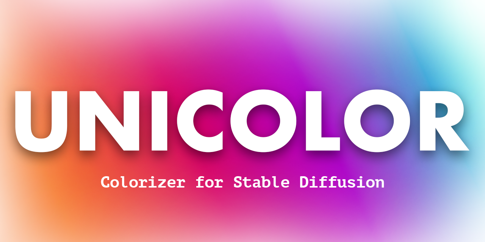

unicolor: A stable diffusion extension, it implements luckyhzt's [Unicolor Colorizer](https://github.com/luckyhzt/unicolor).

<h3>

[Features](#features) | [Installation](#installation)

</h3>

---

I wanted a colorizer that worked easily on an M1 Mac (as well as other systems). I remembered how easy it is to setup a1111, and I did not find any colorizers on the extensions list, so I implemented this one!

There will definitely be bugs so please either make an issue or hit me up on twitter.

## Features

### Stroke Based Coloring (coming soon...)

The original repo supports this, but since Automatic1111 uses Gradio version 3.x. the only way to have a canvas would be to build a custom component that would be out of date as soon as they update to a newer version of Gradio. In Gradio 4.x+ there is a the ImageEditor component which makes things 10x easier. Will be waiting for that update.

### Example Based Coloring

Upload an image close in style to what you want it to look like and the model will create strokes for you resembling it.

### Text Based Coloring

Type descriptions and it will work

## Installation

Follow the guide on how to install extensions [here](https://github.com/AUTOMATIC1111/stable-diffusion-webui/wiki/Extensions).

### Models 

https://huggingface.co/solojungle/sd-web-ui-unicolor-pretrained-models/tree/main

Download the pretrained models (including both Chroma-VQGAN and Hybrid-Transformer) from Hugging Face:

    Trained model with ImageNet - put the file imagenet_step142124.ckpt under folder framework/checkpoints/unicolor_imagenet.
    Trained model with MSCOCO - put the file mscoco_step259999.ckpt under folder framework/checkpoints/unicolor_mscoco.

To use exemplar-based colorization, download the pretrained models from Deep-Exemplar-based-Video-Colorization, unzip the file and place the files into the corresponding folders:

    video_moredata_l1 under the sample/ImageMatch/checkpoints folder
    vgg19_conv.pth and vgg19_gray.pth under the sample/ImageMatch/data folder
    
